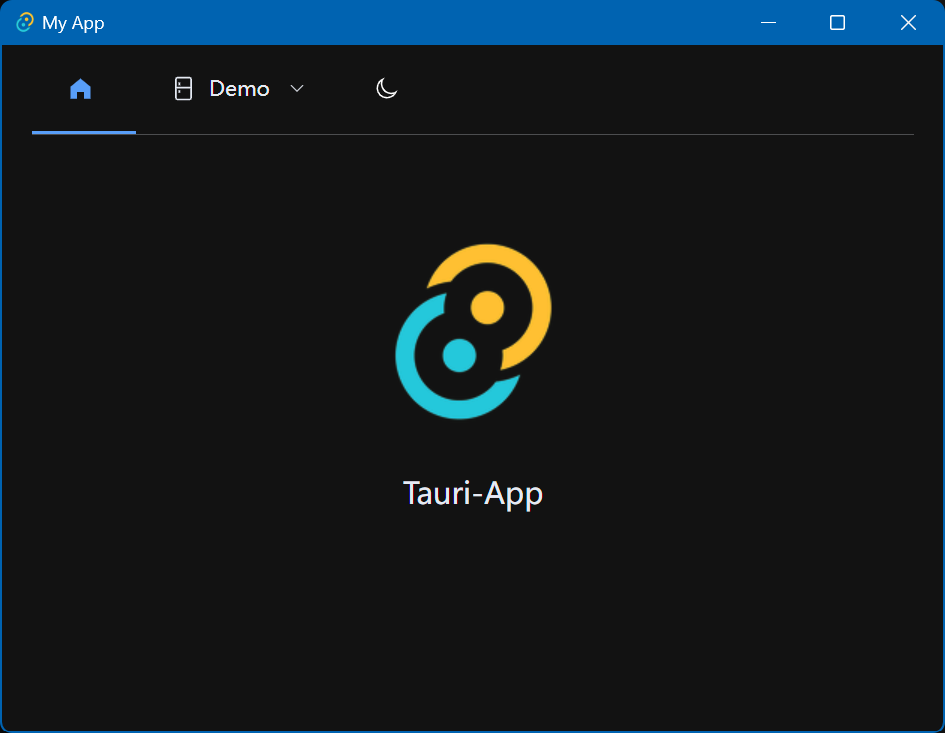

> Tauri / Elememt-Plus / Vuejs starter projects.




## Links

* [Vuejs Page](https://vuejs.org/)
* [Elememt-Plus](https://github.com/element-plus/element-plus)
* [element-plus-vite-starter](https://github.com/element-plus/element-plus-vite-starter)
* [TauriPage](https://tauri.app/)

## build

Install Node 20 LTS

```shell
yarn && yarn tauri build
```

## develop

vite dev

```sh
# vite dev
yarn dev
# tauri dev
yarn tauri dev
# lint & fix 
yarn lint
```

